

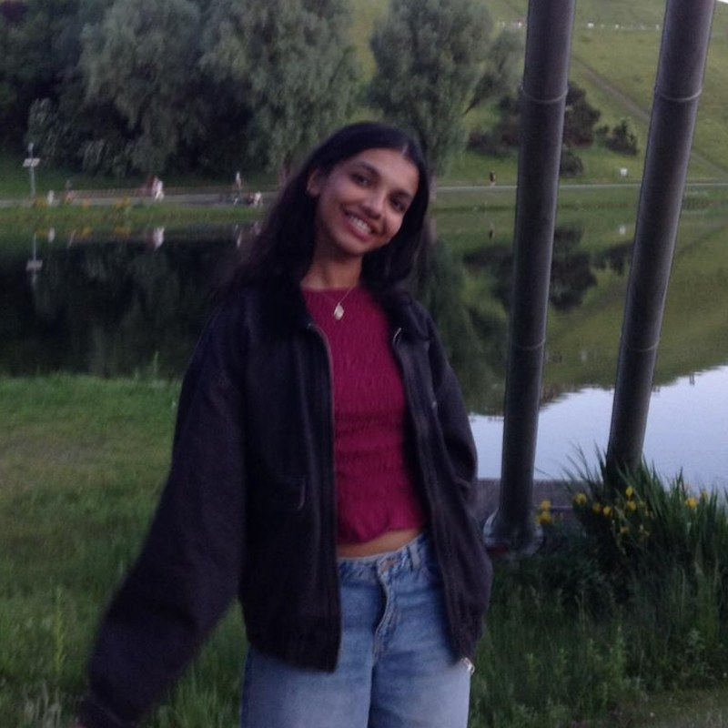

# Sana Fathima Srambicool

Originally from India, grew up in Dubai, now studying Business Intelligence & Process Management at HWR Berlin.

[LinkedIn][(https://www.linkedin.com/in/sana-fathima-srambicool-08749b337/)]
## My Journey

### until 2021 · Dubai
School (CBSE Class 12)

### 2021 – 2022 · Berlin
Studienkolleg at Berlin International College

### 2022 – 2026 · Schweinfurt
B.Eng. Business and Engineering at THWS

### 2025 · Stuttgart
Intern in Sales Acquisition Management at Bosch

### 2025 – 2026 · Stuttgart
Bachelor's thesis and Pre-Master at Bosch

### 2026 – now · Berlin
M.Sc. Business Intelligence & Process Management at HWR Berlin
   <iframe src="journey_map.html" width="100%" height="450" style="border:none; border-radius:10px;"></iframe>
## Places I've lived

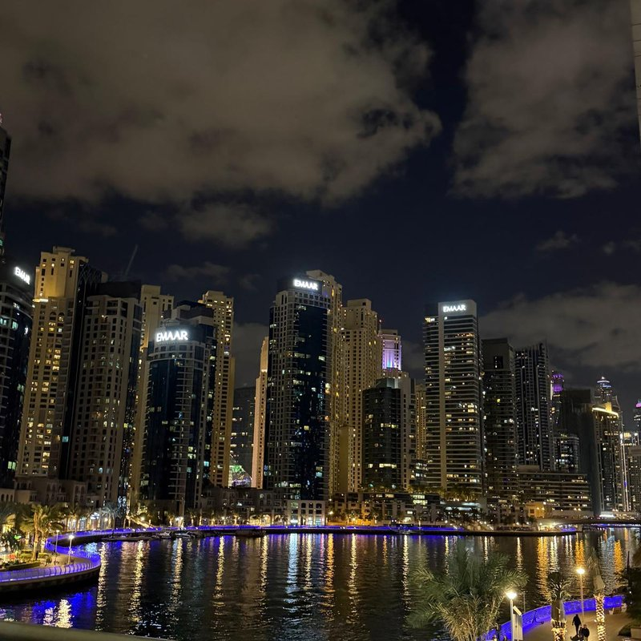 Dubai

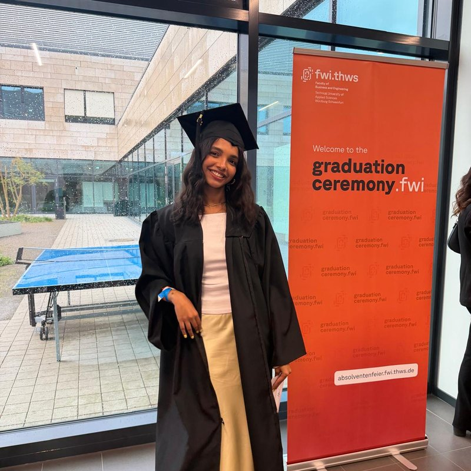 Schweinfurt

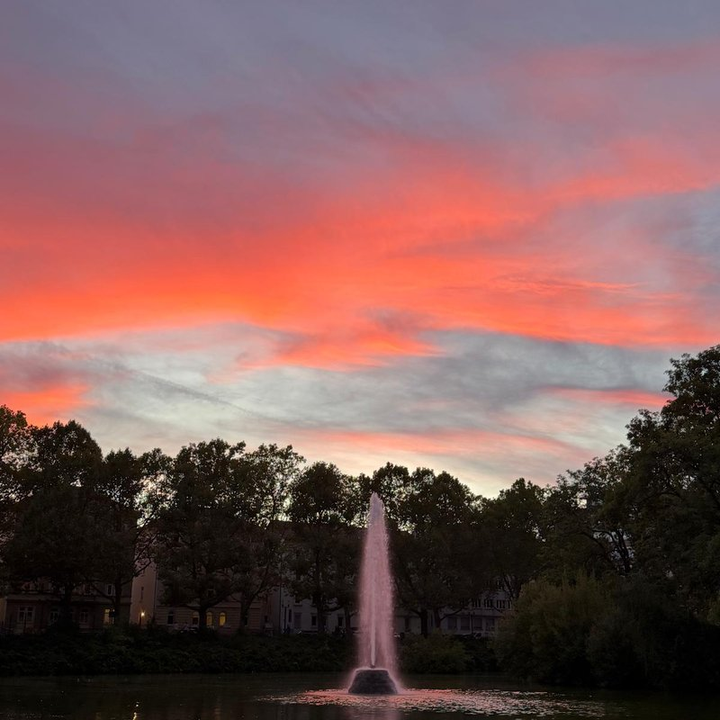 Stuttgart

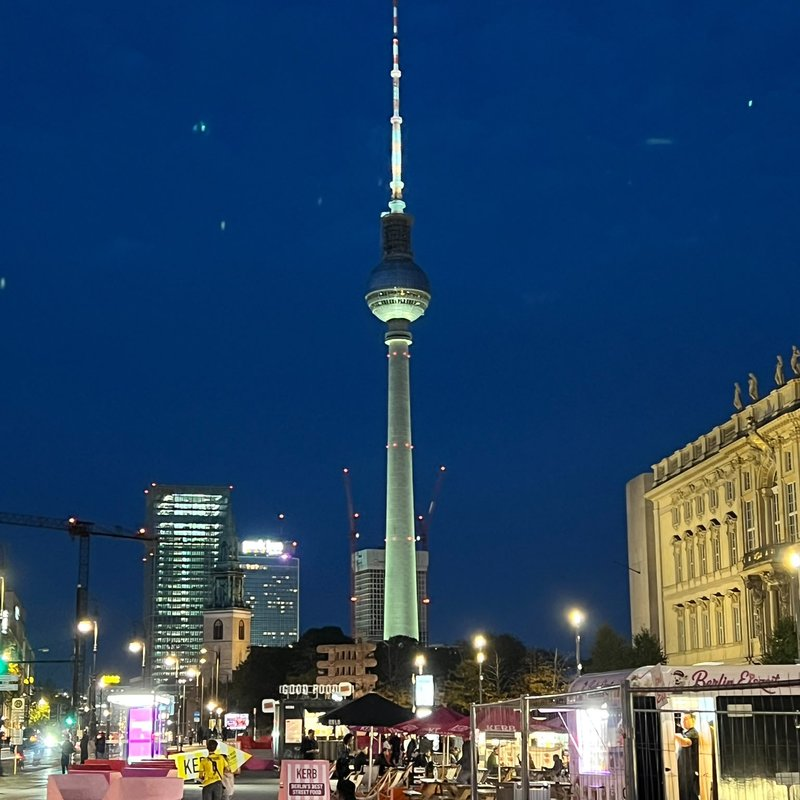 Berlin

## What I like

Reading, baking, travelling, food, matcha, spring, beaches, and sleeping.

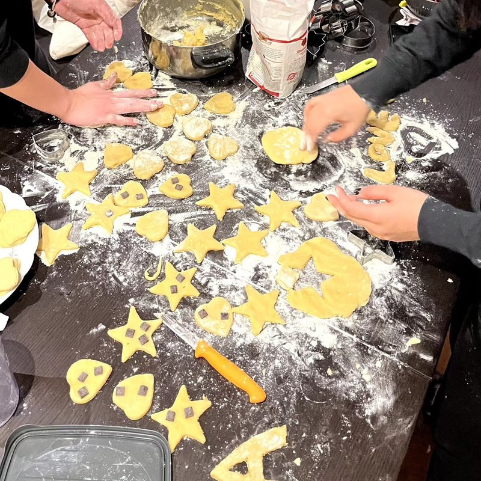
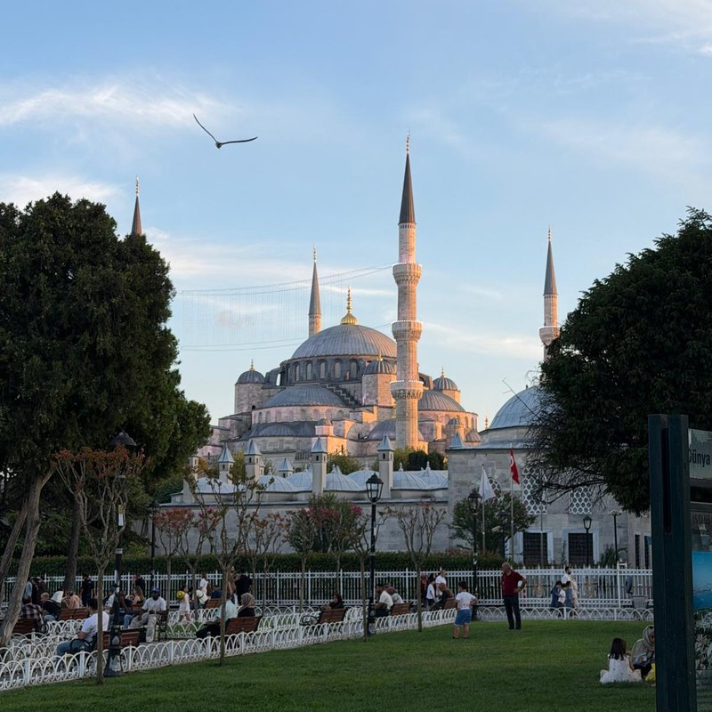
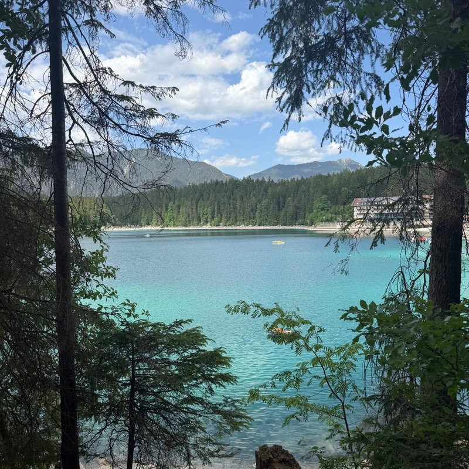
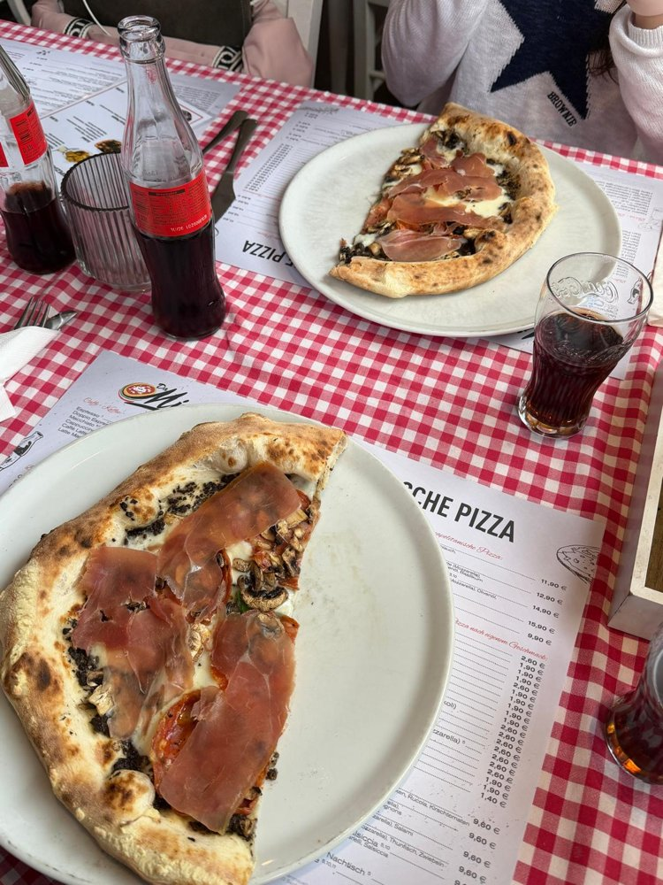
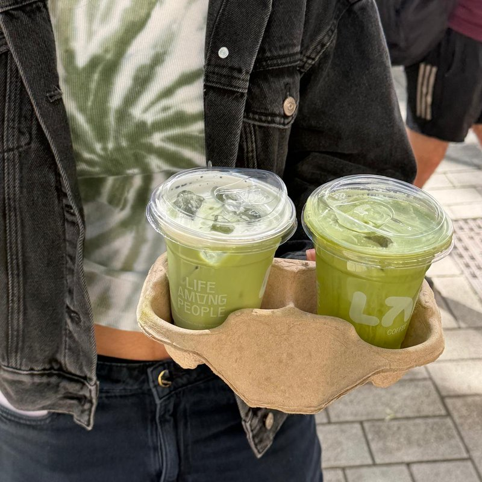
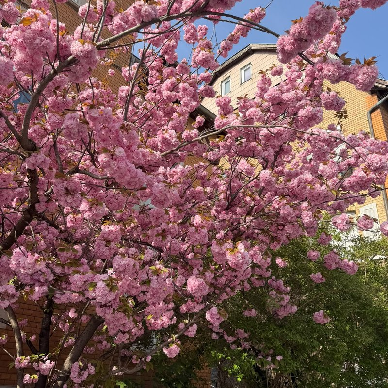
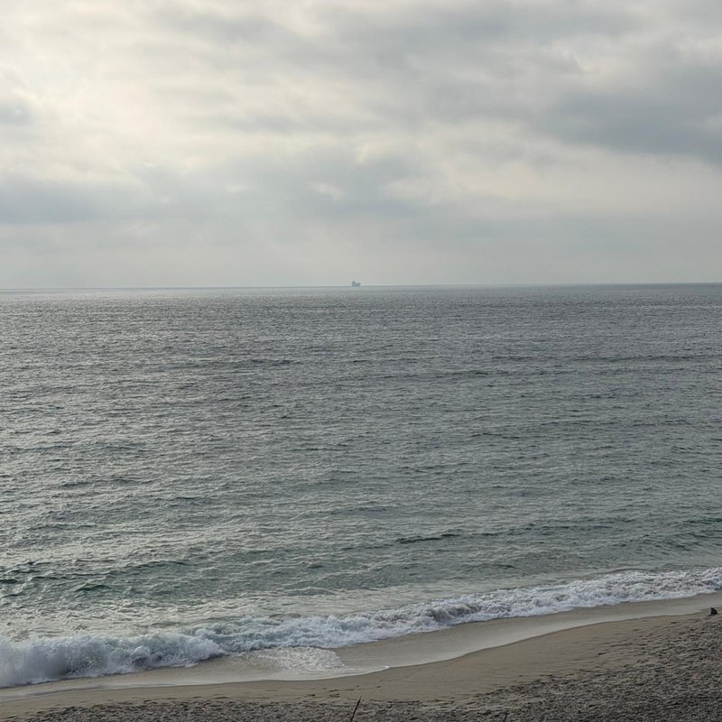
